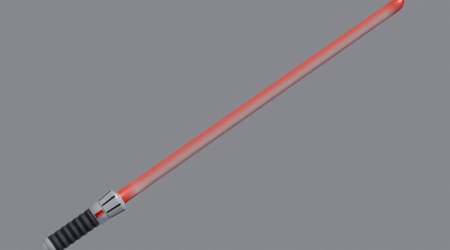

# Sable de Luz — Project Zomboid (Build 42)

Un sable de luz rojo que **brilla de verdad**: al empuñarlo ilumina con luz roja a tu alrededor.
Se encuentra muy raro en el mundo o se arma con piezas.



## Ítems

| Ítem | ID | Dónde |
|---|---|---|
| Sable de Luz | `SL.SableLuz` | Muy raro: casilleros de laboratorio, búnker y armería militar, casas de empeño |
| Cristal Kyber (rojo) | `SL.CristalKyber` | Raro: joyerías (gemas), casas de empeño, antigüedades, laboratorios, universidad |
| Empuñadura de Sable | `SL.EmpunaduraSable` | Tiendas de cómics, tiendas y cajas de electrónica, electrónica militar, laboratorios |

## Recetas (categoría Electricidad, no hay que aprenderlas)

| Receta | Necesita | Nivel |
|---|---|---|
| Armar empuñadura | destornillador, tubo de metal, 2 chatarra electrónica, cable eléctrico, cinta adhesiva | Electricidad 2 |
| Ensamblar sable | destornillador, empuñadura, cristal kyber, 2 baterías | Electricidad 3 |
| Desarmar sable | destornillador, sable → empuñadura + cristal | Electricidad 1 |

**Reparar:** con una batería (Electricidad 2) o 2 chatarra electrónica (Electricidad 3).

## Stats

Pega fuerte (8–14, crítico 35 %, corta hasta 10 zombis por golpe), a dos manos.
v1.1: ya no se rompe a los ~20 golpes (antes perdía durabilidad en *cada* golpe), swing más rápido
(3.0 → 2.2), un poco más liviano (1.5 → 1.2).

## La luz

`media/lua/client/SableLuz_Light.lua` pone una luz roja (radio 4) en la casilla de cada jugador que
tenga el sable en la mano, y la mueve con él. Funciona en solo y en multijugador (cada cliente ilumina
a los jugadores que ve). Se apaga al guardarlo, al soltarlo o si se rompe (condición 0).

## Compatibilidad

- Build 42.15+ (traducciones JSON). Sin dependencias.
- El loot se agrega a las listas vanilla con `OnPreDistributionMerge`; si falta algún contenedor
  solo se avisa en la consola.

## Cómo se genera

Todo (malla `.x`, textura, íconos, poster, scripts, Lua, traducciones) sale de:

```
pip install pillow numpy
python3 build_sableluz.py
```

- `tools/saber.py` — perfil de la malla (torno) y textura; `tools/icons.py` — íconos; `tools/xfile.py` — escritor `.x`.
- El color está en `RED` de `build_sableluz.py`: los colores nuevos serán más cristales.
