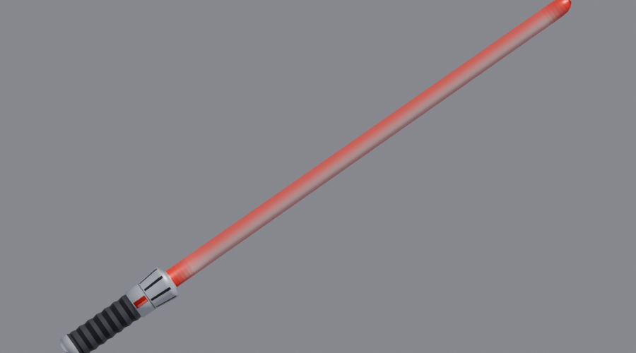

# Sable de Luz — Project Zomboid (Build 42)

Un sable de luz que **brilla y zumba de verdad**: al empuñarlo ilumina a tu alrededor con el color
de su cristal. Viene en **7 colores** y en dos largos: el sable de siempre y uno de **doble hoja**
(como el de Darth Maul). Se encuentra muy raro en el mundo o se arma con piezas.



## Colores

| Color | Cristal | Sable | Doble hoja | Qué tan común |
|---|---|---|---|---|
| Rojo (clásico) | `SL.CristalKyber` | `SL.SableLuz` | `SL.SableLuzDoble` | el más común |
| Azul | `SL.CristalKyber_Blue` | `SL.SableLuz_Blue` | `SL.SableLuzDoble_Blue` | igual de común |
| Verde | `SL.CristalKyber_Green` | `SL.SableLuz_Green` | `SL.SableLuzDoble_Green` | igual de común |
| Púrpura | `SL.CristalKyber_Purple` | `SL.SableLuz_Purple` | `SL.SableLuzDoble_Purple` | poco común |
| Amarillo | `SL.CristalKyber_Yellow` | `SL.SableLuz_Yellow` | `SL.SableLuzDoble_Yellow` | raro |
| Naranja | `SL.CristalKyber_Orange` | `SL.SableLuz_Orange` | `SL.SableLuzDoble_Orange` | raro |
| Blanco | `SL.CristalKyber_White` | `SL.SableLuz_White` | `SL.SableLuzDoble_White` | muy raro |

El rojo mantiene los mismos nombres de ítem de la v1.x (sin sufijo de color), así que no rompe
partidas ya empezadas con esa versión.

## Ítems

| Ítem | Dónde |
|---|---|
| Sable de Luz (7 colores) | Muy raro: casilleros de laboratorio, búnker y armería militar, casas de empeño |
| Sable de Doble Hoja (7 colores) | Ultra raro: solo casilleros de laboratorio y búnker militar |
| Cristal Kyber (7 colores) | Raro: joyerías (gemas), casas de empeño, antigüedades, laboratorios, universidad |
| Empuñadura de Sable | Tiendas de cómics, tiendas y cajas de electrónica, electrónica militar, laboratorios |
| Empuñadura de Sable Doble | Poco común: laboratorios, electrónica militar, tiendas de cómics |

## Recetas (categoría Electricidad, no hay que aprenderlas)

Cada color tiene su propia receta de ensamblar/desarmar (28 en total: 7 colores × sencillo/doble ×
armar/desarmar), además de las dos de las empuñaduras.

| Receta | Necesita | Nivel |
|---|---|---|
| Armar empuñadura | destornillador, tubo de metal, 2 chatarra electrónica, cable eléctrico, cinta adhesiva | Electricidad 2 |
| Armar empuñadura doble | destornillador, 2 empuñaduras, tubo de metal, 2 cinta adhesiva | Electricidad 3 |
| Ensamblar sable (por color) | destornillador, empuñadura, cristal kyber de ese color, 2 baterías | Electricidad 3 |
| Ensamblar sable doble (por color) | destornillador, empuñadura doble, 2 cristales del mismo color, 4 baterías | Electricidad 4 |
| Desarmar (sencillo o doble) | destornillador, sable → empuñadura + cristal(es) | Electricidad 1–2 |

**Reparar:** sencillo con 1 batería (Electricidad 2) o 2 chatarra electrónica (Electricidad 3);
doble con 2 baterías o 3 chatarra electrónica (dos emisores que alimentar).

## Stats

Pega fuerte (8–14, crítico 35 %). El sencillo corta hasta 10 zombis por golpe, no se rompe a los
~20 golpes (antes perdía durabilidad en *cada* golpe), swing 2.2 y pesa 1.2.

El de **doble hoja** pega a más enemigos por lo largo (hasta 14), llega más lejos (2.4 en vez de
2.0) pero es más pesado (2.1) y un poco más lento de blandir (swing 2.6).

## Encendido: luz y sonido

`media/lua/client/SableLuz_Encendido.lua`, mientras alguien tiene un sable en la mano:

- pone una **luz del color de su cristal** (radio 4, o 5 en el de doble hoja) en su casilla y la
  mueve con él; si cambia de sable a mitad de partida, la luz cambia de color al toque;
- suena el **encendido** al empuñarlo, un **zumbido** en loop mientras lo tiene y el **apagado** al
  guardarlo, soltarlo o si se rompe (condición 0).

Funciona en solo y en multijugador (cada cliente ilumina y hace sonar a los jugadores que ve). El
zumbido sale solo por los parlantes: no atrae zombis.

| Sonido | Cuándo | Origen |
|---|---|---|
| `SableLuzSwing` | cada golpe al aire | el audio original del mod (`sable_sonido.mp3`) |
| `SableLuzHit` | al pegarle a algo | choque chisporroteante (sintetizado) |
| `SableLuzOn` / `SableLuzOff` | encender / apagar, soltar o romperse | sintetizado |
| `SableLuzHum` | zumbido en loop | sintetizado, loop sin cortes |

Un solo juego de sonidos para los 7 colores y los dos largos. Los sintetizados salen de
`tools/sounds.py` (numpy): se regeneran con el build.

## Compatibilidad

- Build 42.15+ (traducciones JSON). Sin dependencias.
- El loot se agrega a las listas vanilla con `OnPreDistributionMerge`; si falta algún contenedor
  solo se avisa en la consola.

## Cómo se genera

Todo (mallas `.x`, texturas, íconos, poster, scripts, Lua, traducciones) sale de:

```
pip install pillow numpy
python3 build_sableluz.py
```

- `tools/saber.py` — perfil de la malla (torno, sencilla y de doble hoja) y textura de cada color.
- `tools/icons.py` — íconos (sables, cristales, empuñaduras, sencillas y dobles).
- `tools/xfile.py` — escritor `.x`. `tools/sounds.py` — sonidos sintetizados.
- Los colores están en la lista `COLORS` de `build_sableluz.py`: agregar uno ahí genera solo, en
  el próximo build, su cristal, su sable, su doble hoja, sus recetas, su loot y sus traducciones.
- **Cómo funciona la variedad de color sin duplicar mallas:** una única malla por largo (sencilla /
  doble) sirve para los 7 colores — solo cambia la textura que cada `model` referencia. El sable
  de doble hoja además reusa el algoritmo de textura del sencillo dos veces (una por mitad,
  comprimida a la mitad de alto y unida al centro), así que hasta admite un sable **bicolor** si
  alguna vez se quiere (`saber.make_texture_double(path, color_arriba, color_abajo)`).
